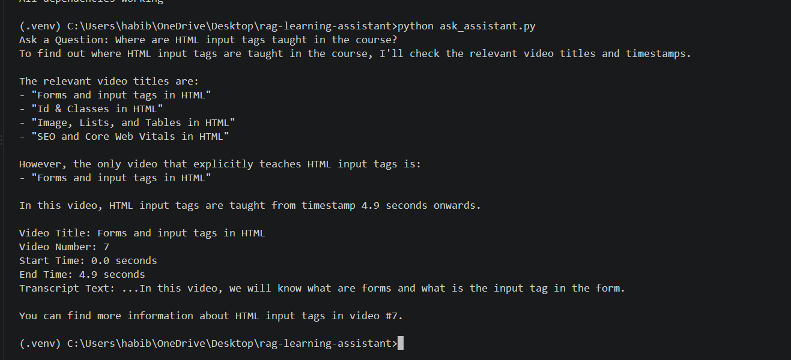

# RAG Learning Assistant

A Retrieval-Augmented Generation (RAG) learning assistant that helps users find where specific topics are taught in a web development video course.

The project processes Hindi educational videos, converts speech to text using OpenAI Whisper, creates semantic embeddings, retrieves the most relevant video sections using cosine similarity, and uses Llama 3.2 to generate an answer with relevant video timestamps.

## Features

- Hindi speech-to-text and translation using OpenAI Whisper
- Video transcript segmentation into timestamped chunks
- Semantic embeddings using Ollama
- Similarity search using cosine similarity
- Retrieval of the most relevant video sections
- Llama 3.2 for generating natural-language responses
- Provides relevant video numbers and timestamps for learning

## Project Pipeline

```text
Hindi Course Videos
        ↓
   Audio Extraction
        ↓
   OpenAI Whisper
        ↓
 Timestamped Text Chunks
        ↓
   Semantic Embeddings
        ↓
 Cosine Similarity Search
        ↓
 Top Relevant Chunks
        ↓
     Llama 3.2
        ↓
 Learning Assistant Response
```

## Technologies Used

- Python
- OpenAI Whisper
- Ollama
- Llama 3.2
- Nomic Embed Text
- NumPy
- Pandas
- Scikit-learn
- Joblib
- Requests
- FFmpeg

## How It Works

1. Course videos are converted into audio files.
2. Whisper processes the Hindi audio and translates it into English text.
3. The transcript is divided into timestamped chunks.
4. Each chunk is converted into a numerical embedding.
5. When a user asks a question, the question is also converted into an embedding.
6. Cosine similarity is used to find the most relevant video chunks.
7. The top matching chunks are provided to Llama 3.2.
8. The model generates a response indicating which video and timestamp contain the relevant information.

## Example

A user can ask:

> Where are HTML input tags taught in the course?

The system retrieves the most relevant video sections and provides the video number and timestamp where the topic is discussed.

## Project Structure

```text
rag-learning-assistant/
│├── extract_audio.py
├── transcribe_videos.py
├── generate_embeddings.py
├── ask_assistant.py
```

## Demo

A short demonstration of the RAG-Based Learning Assistant in action.

[▶️ Watch the project demo](./RAG%20based%20Ai%20learning%20assist%20demo.mp4)

## Local Requirements

This project requires:

- Python 3
- FFmpeg
- Ollama
- Llama 3.2
- Nomic Embed Text

The large video, audio, Whisper model, generated embeddings, and course transcript data are intentionally excluded from the repository.

## Installation

### 1. Clone the repository

```bash
git clone https://github.com/Habib0910/rag-learning-assistant.git
cd rag-learning-assistant

### 2. InstaLL PYTHON  dependencies 
pip install -r requirements.txt


### 3.Install Ollama Models 
#make Sure Ollama is running then 
ollama pull nomic-embed-text
ollama pull llama3.2

### 4. Install FFmpeg , which is required for extracting audio from the course video 


## Future Improvements

- Build a user-friendly web interface
- Improve retrieval accuracy
- Add conversation memory
- Support more courses and languages
- Add automated evaluation of retrieved answers


## Running the Project

The project is run as a sequence of Python scripts.

### 1. Extract Audio

```bash
python extract_audio.py

### 2. Generate Transcript chunks 
python transcribe_videos.py
#This uses OpenAI Whisper to convert the Hindi audio into English text and creates timestamped transcript chunks.

### Generate Embeddings 
python generate_embeddings.py
# This generates embeddings for the transcript chunks using the nomic-embed-text model through Ollama.

### 4. Ask a question 
python ask_assistant.py
# The program asks the user for a question, retrieves the most relevant transcript chunks using cosine similarity, and uses Llama 3.2 to generate the final response.


## Technical Details

The project uses a Retrieval-Augmented Generation (RAG) approach.

### Retrieval

When the user enters a question, the system converts the question into an embedding using `nomic-embed-text`.

The embedding is compared with the stored transcript embeddings using cosine similarity.

The top 5 most similar transcript chunks are retrieved.

### Generation

The retrieved transcript chunks and the user's question are provided to Llama 3.2.

Llama 3.2 uses this retrieved context to generate a response that identifies the relevant video and timestamp.

### Why RAG?

Instead of asking the language model to answer from general knowledge, the system first retrieves relevant information from the course transcripts.

This allows the generated response to be grounded in the specific course content.


## Demo

Example query:

> Where are HTML input tags taught in the course?

The assistant retrieves the relevant course content and identifies the corresponding video and timestamp.


